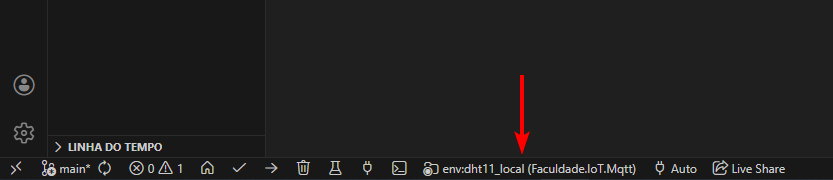

# Configurar credenciais (env)

1. Copie `include/env.h.example`, renomeie para `include/env.h` e insira suas credenciais.

2. Edite `include/env.h` com seu SSID, senha e configurações MQTT.

3. O arquivo `include/env.h` já está listado em `.gitignore`, portanto não será enviado ao repositório.

4. Se você acidentalmente comitou `include/env.h`, remova-o do índice e crie um commit:

```powershell
git rm --cached include/env.h
git commit -m "Remover env.h com credenciais"
```

O arquivo de exemplo `include/env.h.example` está mantido no repositório para que outros usuários possam copiar e configurar localmente.

# Instalação

1. [Instale o PlatformIO Core](https://docs.platformio.org/page/core.html)
2. Execute esses comandos:

```shell
# Somente 'buildar' o projeto
$ pio run

# Enviar o programa para a placa (upload)
$ pio run --target upload

# Monitorar a placa (a localidade deve estar na pasta do projeto)
$ pio run --target monitor

# Build um ambiente específico
$ pio run -e nodemcuv2

# Enviar o programa para a placa em um ambiente específico
$ pio run -e nodemcuv2 --target upload

# Limpar arquivos de build
$ pio run --target clean
```


Projeto dht_server
=====================================

Este projeto roda em um ESP8266 lendo um sensor DHT11 e oferecendo:
- Interface web em LittleFS (UI em `/index.html` e `/config.html`).
- Configuração de Wi‑Fi via AP (rede `ESP-DHT11-Setup`) e formulário em `/config.html`.

Como usar
---------
1. Instale o PlatformIO e abra este projeto.
2. Carregue a imagem do sistema de arquivos

```powershell
pio run -t uploadfs --environment dht11_server
```

3. Compile e envie o firmware para o ESP8266:

```powershell
pio run -t upload --environment dht11_server
```

4. Conecte seu computador/telefone à rede Wi‑Fi criada pelo ESP: `ESP-DHT11-Setup`.
5. Acesse `http://192.168.4.1/` e abra a página de configuração. No formulário, informe o `SSID` e `Senha` e clique em `Salvar e conectar`.

Comportamento após enviar credenciais
------------------------------------
- O ESP tenta conectar à rede fornecida. Após a conexão, encontre o novo IP do dispositivo conectado à sua rede.
- O servidor responde imediatamente com a página de leitura (`/index.html`) ou com um JSON contendo a leitura atual (`/read`) para que o usuário veja temperatura e umidade sem precisar reiniciar.

Resetar Wi‑Fi / voltar ao modo de configuração
--------------------------------------------
- A página `/index.html` tem um botão `Escolher outro Wi‑Fi` que faz um POST em `/clear` — isso desconecta o STA e reativa o modo AP para nova configuração.

Endpoints úteis
--------------
- `/` ou `/index.html` — interface de leitura (temperatura/umidade).
- `/config.html` — interface de configuração Wi‑Fi (quando em AP).
- `/read` — retorna JSON com `{ "temp": <C>, "hum": <%> }`.
- `/mqtt/publish` — publica uma leitura manualmente (form POST com `topic`).
- `/fs` e `/fs/*` — gerência de arquivos em LittleFS (download/upload/delete/list).

Desenvolvimento
---------------

- Monitor serial (após upload):

```powershell
pio device monitor --environment dht11_server
```

Para alterar o projeto, altere o ambiente no ícone de pasta abaixo do VS Code e faça upload novamente

